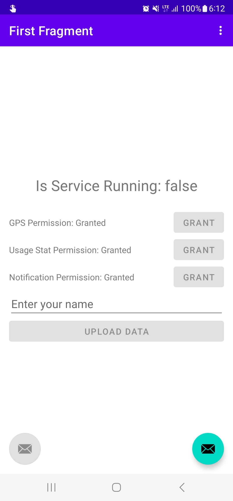

UserDeviceProfiler 안내
=====================

> UserDeviceProfiler는 사용자의 디바이스 및 사용 패턴 정보를 수집합니다.

## 1. 수집 데이터
- 사용자의 디바이스 정보(GPS, screen on/off, 화면 밝기, 배터리 정보 등)
- 사용자의 앱 사용 패턴 정보(사용 시간, 사용 어플리케이션 등)

## 2. 필요 권한
- GPS 권한
  - 허용방법:
        
    </img>
    
    앱을 처음 실행하면 다음과 같은 안내가 나옵니다. 앱 사용 중에만 허용을 선택하세요. 다만 이 경우 이 앱이 실제로 켜진 경우에만 GPS 정보를 수집합니다. 따라서 어플리케이션->설정에 들어가서 다음처럼 GPS 정보를 항상 허용으로 설정해야 합니다.

    </img>

- Usage data 권한
  - 허용방법:

    </img>

    앱을 처음 실행하면 다음과 같은 안내가 나옵니다. UserDeviceProfiler를 찾아서 허용합니다. 본 권한이 허용되어야 프로파일링이 가능합니다.

- 알림 권한
  - 허용방법

    </img>

    앱을 실행하면, 마찬가지로 위와 같은 안내가 나옵니다. 알림을 허용해야, 현재 앱이 실행되고 있는지 알 수 있습니다.

## 3. 사용방법
> ### 주의 사항
> 1. 하루에 한 번 정도 업로드 버튼을 눌러주세요. 만약 업로드를 시도했는데, 업로드에 성공했다는 메시지가 나오지 않는다면, yujin_shin@yonsei.ac.kr로 리포트 부탁드립니다.
> 2. 업로드 할 때는 반드시 기록을 종료하고 업로드 부탁드립니다. 또한, 업로드 시 이름은 반드시 일관되게 올려주시기 부탁드립니다.

- 앱을 실행하면 다음과 같은 화면이 나옵니다.

    </img>

- 우하단의 버튼을 누르면, 프로파일링이 실행됩니다. 앱 사용 권한을 허용해야 누를 수 있습니다.
- 좌하단 버튼은 프로파일링을 종료하는 역할을 합니다.
- 현재 프로파일링이 실행되고 있는 지를 확인할 수 있습니다.
- 현재 승인된 권한을 확인할 수 있습니다. 권한이 승인되지 않은 경우, Grant 버튼이 활성화 되며, 버튼을 누르면 권한을 승인 페이지로 이동할 수 있습니다.
- 이름을 입력하지 않으면 업로드를 할 수 없습니다. 업로드에는 약간의 시간이 필요하니, 업로드가 성공했다는 메시지가 나올때까지 잠시 대기해주시기 바랍니다.